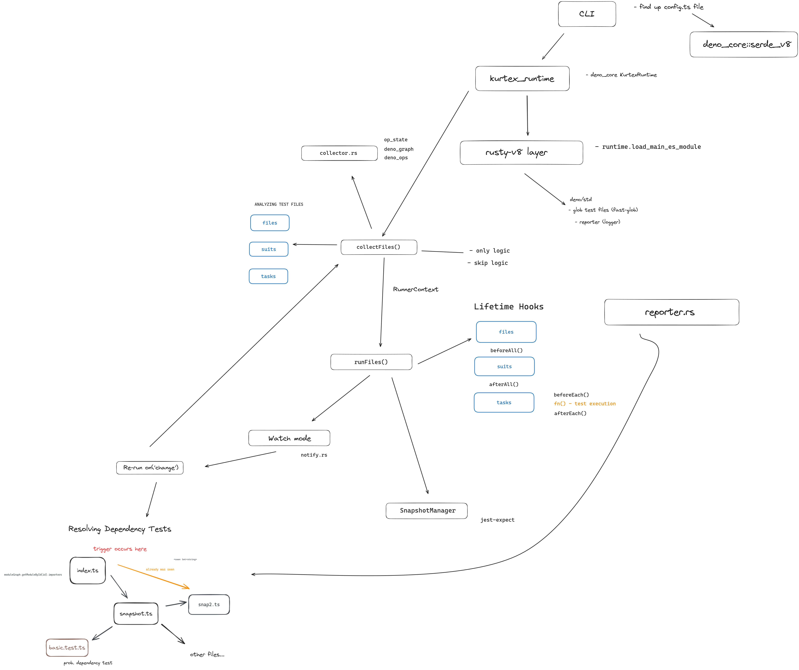

<h1 align="center">
Kurtex
</h1>
<p align="center">
Testing framework, written in Rust
<p>

[vitest.dev](https://vitest.dev) short-written analogue. 
Written in rust using [swc](https://swc.rs), [rusty-v8](https://github.com/denoland/rusty_v8), [Deno](https://github.com/denoland/deno_core) low-level APIs.

Collects files, runs them, prints output. Supports functionality such as watch mode, resolving dependency tests, logger, snapshot manager, reporter.

## Examples

```typescript
// tests/basic.test.ts
import { assertEquals } from 'jsr:@std/assert';
// Alternatively, you can add methods from @kurtex/mod deno package.
// import { test, describe, beforeAll, afterAll } from '@kurtex/mod'

test('Math.sqrt()', () => {
  const x = 1 + 2;
  assertEquals(x, 3);
})

test.concurrent('test 1', async ({ expect }) => {
  expect(foo).toMatchSnapshot()
})
test.concurrent('test 2', async ({ expect }) => {
  expect(foo).toMatchSnapshot()
})

describe('reference', () => {
  beforeAll(async () => {
    await startMocking()
  })

  afterAll(async () => {
    await stopMocking() // this method is called after all tests run
  })

  test.skip('skipped test', () => {
    // Test skipped, no error
    assertEquals(Math.sqrt(4), 3)
  })

  test.only('should print error', () => {
    assertEquals(Math.sqrt(4), 2);
  })


  test('should be skipped, because of only flag', () => {
    assertEquals(Math.sqrt(4), 2);
  })
})


describe.skip('block should be skipped', () => {
  beforeEach(async () => {
     // called once before each test run
     await prepareSomething()
  })


  test('will not run because of skip', () => {
    assertEquals(Math.sqrt(4), 2);
  })

  test.todo('unimplemented test')
})


```

Run

```typescript
// kurtex.config.ts
import { defineConfig } from '@kurtex/mod'

export default defineConfig({
    includes: ['dev/tests/*.test.ts'],
    excludes: ['**/node_modules/**', '**/fixtures/**', 'dev/tests/*.js'],
    watch: true,
    parallel: true
})
```

```shell
ktx --help

ktx
```

## How it works


> [!WARNING]
> Early stage of development
## Literature

- [Deno overall architecture](https://choubey.gitbook.io/internals-of-deno/architecture/overall-architecture)
- [rusty-v8](https://choubey.gitbook.io/internals-of-deno/architecture/rusty_v8)
- [js-runtime](https://choubey.gitbook.io/internals-of-deno/foundations/jsruntime)
- [Deno 'ops'](https://choubey.gitbook.io/internals-of-deno/import-and-ops/5.6-registration-of-ops)
- [Vitest old versions](https://github.com/kurtexdev/vitest)
